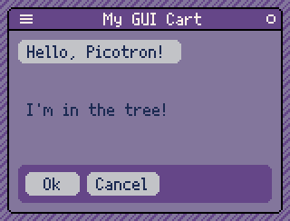

# Picotron API > GUI

Main contributions by `@Podepi`, `@KeyboardDanni`

## Overview

Picotron includes a lightweight GUI framework that can be used in apps as well as games. Use of it is optional, and it's possible to make your own GUI system as well, but the built-in GUI can save you considerable development time on small to medium projects.

Picotron's GUI library uses a tree of `GuiElement` tables, with a "head" (root) element at the top, and each element containing any number of child elements. If you've ever used other tree-based frameworks like Qt or Godot, this one operates on a similar principle.

Every element has its own set of [Event Callbacks](event_callbacks/readme.md). In most cases, there will be at least a [draw()](event_callbacks/draw/main.md) callback, though there may also be an [update()](event_callbacks/update/main.md) callback, similar to how the `_update()` and `_draw()` callbacks work in Picotron programs. Mouse clicks on buttons are usually implemented using [tap()](event_callbacks/tap/main.md).

## Creation

To begin using the GUI, call `create_gui()` during initialization:

```lua
local gui

function _init()
	gui = create_gui()
end
```

In order for the GUI to be functional, you will also need to call `gui:update_all()` and `gui:draw_all()` in the appropriate places:

```lua
function _update()
	gui:update_all()
end

function _draw()
    cls(13)

	gui:draw_all()
end
```

To add elements, call one of the [Attachment](attachments/readme.md) functions. For this example, we'll expand our `_init()` function to display our cart in a window and attach a button.

```lua
function _init()
	window {
		title = "My GUI Cart",
		width = 150,
		height = 100
	}

	gui = create_gui()
	
	gui:attach_button {
		x = 5,
		y = 5,
		label = "Hello, Picotron!",
		tap = function(self, msg)
			notify("Button pressed!")
		end
	}
end
```

The result should look like this:


Clicking the button will trigger a "Button pressed!" notification at the bottom of the screen.

## Nested Elements

We've seen that we can create and attach GUI elements by calling `gui:attach_button` and friends. But we can also nest elements to create more complex components. This is the key to reusability. Let's make a basic button box component that contains two buttons, "Ok" and "Cancel":

```lua
local button_box = gui:attach {
    x = 5,
    y = 74,
    width = 140,
    height = 21,
    draw = function(self, msg)
        rrectfill(0, 0, self.width, self.height, 2, 18)
    end
}

local button_ok = button_box:attach_button {
    x = 4,
    y = 4,
    width = 30,
    label = "Ok"
}

button_box:attach_button {
    x = button_ok.width + 8,
    y = 4,
    label = "Cancel"
}
```

The result:


A few things are happening here. First, we are creating a "container" element for our button box and storing it in the `button_box` variable. This container has a `draw()` callback to illustrate its bounding box. Next, we use `button_box:attach_button` to attach the buttons to the `button_box` instead of `gui`.

You might notice that `button_ok` has `x = 4, y = 4`, yet is located further down instead of at the top of the window. This is because coordinates are local to the parent element. This means we can reposition our `button_box` wherever we want and the buttons will move along with it.

Keep in mind that by default, any child elements will be clipped to be within the parent's bounding box. So remember to set an appropriate `width` and `height` on the parent.

## Tree Management

Previously we've been adding elements to our interface by doing this:

```lua
gui:attach {
    x = 5,
    y = 5,
    width = 20,
    height = 20
}
```

However, this is actually performing two operations: creating the element, and then attaching it to the tree. The tree includes everything that is currently considered "part of" the user interface. However, it is possible to hold onto an element outside the tree. Such elements do not run their `update()` or `draw()` callbacks until they are attached to the tree.

It is possible to create an unattached element using `gui:new()`. You can then later attach it using `gui:attach()`. The GUI system will recognize that it is already a `GuiElement` and avoid creating a new element:

```lua
local element = gui:new {
    x = 5,
    y = 50,
    width = 100,
    height = 20,
    draw = function(self, msg)
        print("I'm in the tree!", 0, 0, 1)
    end
}

gui:attach(element)
```



It is possible to remove an element from the tree by detaching it:

```lua
element:detach()
```


The element may now be garbage-collected, assuming it doesn't have any other references pointing to it. Or, you may reattach the previously detached element at a later time.

Every attached GUI element has variables that allow tree traversal: `head`, `parent`, and `child`.

`head` is simply a reference to the root element, which is created via `create_gui()`. In our program, this is the `gui` variable. This is mainly so you don't have to make `gui` accessible to the entire program.

`parent` allows accessing the element's parent. For example, we could add this callback to our "Ok" button:

```lua
tap = function(self, msg)
    notify(self.parent.width)
end
```

Clicking the button will now display `140`, the width of our button box.

`child` is an array table containing every element nested under the current element. For example, you can remove the contents of `element` (but keep `element` itself) with the following:

```lua
for i = #element.child, 1, -1 do
    element.child[i]:detach()
end
```

Be careful when debugging GUI elements, as the `parent`/`head` references can cause nested iteration to recurse infinitely and crash Picotron.

## Performance

Every frame, the GUI system will recompute the bounds of all the elements in the tree and run their `update()` and `draw()` callbacks. This means that the more elements you have in your tree, the more CPU time is needed. If your UI is split between several pages, consider attaching and detaching them as needed instead of keeping everything attached at once. If you have a large scrolling item list with hundreds of items or more, create only the items that will be in-view, and add/remove items as necessary as the list scrolls.

If you are making a desktop cart that doesn't need to animate while idle, consider only running your drawing code once every 5 frames or so, or when there is an animation update. To keep your UI responsive, you may want to mark it "dirty" when interacting with the window so that changes become visible on the same frame instead of several frames later.

Try to limit the use of `update()` callback processing in elements. Where possible, stick to interaction-based event callbacks like `tap()`. And of course, remember to cache the results of expensive calculations such as word-wrapping.

## References
[Event Callbacks](event_callbacks/readme.md)

[Attachments](attachments/readme.md)

[Attributes](attributes/readme.md)